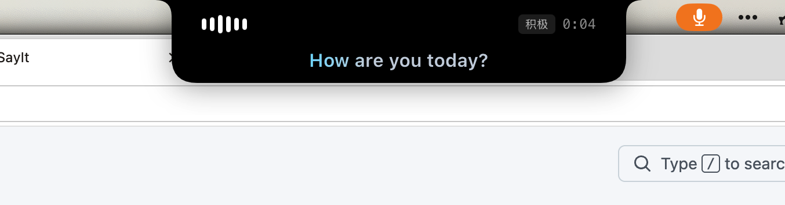

<p align="center">
  
</p>

<h1 align="center">SayIt</h1>

<p align="center">
  <strong>按住说话，松开粘贴</strong> — macOS 语音输入桌面工具<br/>
  在任意应用中说话，经 ASR 转写 + LLM 整理后，自动粘贴到光标位置。
</p>

<p align="center">
  <a href="https://github.com/yee94/SayIt/releases/latest"></a>
  
  
  
  
  
  
  
</p>

<p align="center">
  <a href="#-和-typeless-的关系">与 Typeless</a> ·
  <a href="#-功能">功能</a> ·
  <a href="#-下载">下载</a> ·
  <a href="#-快速开始">上手</a> ·
  <a href="#-技术栈">技术栈</a> ·
  <a href="#-本地开发">开发</a>
</p>

---

## 和 Typeless 的关系

SayIt 在交互上借鉴了 [Typeless](https://www.typeless.com/)：全局热键、口语转书面语、自动粘贴到光标。日常用法接近，目标都是「说话代替打字」。

主要差异在**计费与模型归属**：

| | Typeless | SayIt |
|--|----------|-------|
| 产品形态 | 闭源商业应用，订阅制 | 开源（MIT），自托管配置 |
| 语音识别 / 整理 | 官方打包服务 | **自行配置 ASR + LLM** |
| 费用 | 官方套餐订阅 | 按所用 API 的用量计费，通常远低于订阅套餐 |
| 模型选择 | 由官方决定 | 可换 ASR 凭据；LLM 接任意 OpenAI 兼容接口 |
| 词典 | 内置词典体系 | 词典；macOS 可从 Typeless **一键导入**已有词条 |

效果上：选用合适的 ASR（当前默认对接豆包 SeedASR）与 LLM 后，整理质量可以做到接近同类产品；成本侧则是「你自己的 API 账单」，而不是按月锁死在官方套餐里。

> SayIt 本身免费。你只需为火山引擎 ASR、以及所选 LLM 提供商的 API 用量付费。

---

## 功能

### 语音输入

1. 按住全局快捷键开始录音  
2. 松开后：ASR 转写 → LLM 整理口语为书面语  
3. 结果自动粘贴到当前光标位置  

- **整理模式**：精简（少改动）/ 积极（更重整理）/ 自定义 Prompt  
- **实时字幕**：录音过程中 HUD 流式显示识别文字（豆包 SeedASR）  
- **语意守卫**：若 LLM 输出与原文明显脱钩，回退为原始逐字稿  

### 编辑选取文字

选中一段文字后按快捷键，用语音下达指令（如「翻成中文」「改正式一点」「缩短成一句话」），AI 改写后贴回原处。适合翻译、改写、摘要。

### 全局快捷键

| 能力 | 说明 |
|------|------|
| Hold / Toggle | 按住说话，或按一下开始、再按一下停止 |
| 单键 / 组合键 | 如 `Fn`、右 Option，或 `⌘+J` 等组合 |
| 双击切换模式 | 连按两下快捷键，在「精简 / 积极」间切换 |
| ESC 取消 | 中止当前录音 / 流程 |
| HUD | 顶部浮层：波形、模式、计时、实时字幕 |

### 词典

- 手动添加专有名词、品牌名、术语  
- 智能学习：可从修正中自动收录新词  
- Typeless 词典导入（macOS）：读取本机 Typeless 词条并批量加入，重复项跳过  

### Dashboard

| 模块 | 内容 |
|------|------|
| 历史 | 搜索、复制、回放录音、重新转录 |
| 统计 | 用量与趋势 |
| 设置 | 热键、麦克风、Prompt、ASR/LLM 凭据、开机启动等 |
| 功能导览 | 应用内说明各功能怎么用 |

### 其他

- 录音时可选自动静音系统扬声器（减少回声）  
- 音效反馈；麦克风选择与音量预览  
- 粘贴后可选还原剪贴板内容  
- 开机自启、菜单栏常驻、自动检查更新  
- 界面四语：简体中文 / English / 日本語 / 한국어  
- macOS：打开 Dashboard 时显示 Dock 图标，关闭后隐藏，仅保留菜单栏入口  

---

## 下载

| 平台 | 安装包 |
|------|--------|
| macOS Apple Silicon | [SayIt-mac-arm64.dmg](https://github.com/yee94/SayIt/releases/latest/download/SayIt-mac-arm64.dmg) |
| macOS Intel | [SayIt-mac-x64.dmg](https://github.com/yee94/SayIt/releases/latest/download/SayIt-mac-x64.dmg) |
| Windows x64 | [SayIt-windows-x64.exe](https://github.com/yee94/SayIt/releases/latest/download/SayIt-windows-x64.exe) |

更多版本见 [Releases](https://github.com/yee94/SayIt/releases)，变更记录见 [CHANGELOG.md](CHANGELOG.md)。

> macOS release 使用 Apple Developer ID 签名与公证。开发者需要先完成[本地与 CI 的签名配置](docs/apple-signing.md)；Windows 安装包未做代码签名。

应用内更新使用 GitHub Releases 的 Tauri 签名更新包，配置说明见 [自动更新](docs/auto-updates.md)。

---

## 快速开始

1. **安装并打开** SayIt  
2. **配置凭据**  
   - 语音转写：在 [火山引擎控制台](https://console.volcengine.com/) 创建豆包 ASR，填写 App ID / Access Key  
   - 文字整理：配置任意 **OpenAI 兼容** LLM（Base URL + API Key + Model ID）  
3. **按住快捷键说话**，松开后文字自动粘贴  

macOS 首次使用需授予「辅助使用」权限（全局热键与自动粘贴依赖此权限）。  
设置页提供「测试连接」，可分别验证 ASR 与 LLM。

LLM 只要兼容 OpenAI Chat Completions（`/v1/chat/completions`）即可，例如 OpenAI、Groq、各类兼容网关或本地服务。

---

## 流程概览

```
全局热键 → 豆包 SeedASR（流式转写）→ OpenAI 兼容 LLM（整理）→ 粘贴到光标
              ↑ 词典注入                    ↑ 精简 / 积极 / 自定义
                                            ↑ 语意守卫（必要时回退原文）
```

双窗口：

| 窗口 | 用途 |
|------|------|
| HUD | 透明置顶状态浮层（录音 / 转写 / 整理 / 完成） |
| Dashboard | 设置、历史、词典、统计、功能导览（默认隐藏） |

---

## 技术栈

| 层级 | 选型 |
|------|------|
| 桌面 | Tauri v2 |
| 前端 | Vue 3 · TypeScript · Pinia · shadcn-vue · Tailwind CSS |
| 后端 | Rust（音频、热键、剪贴板、系统音频控制等） |
| 语音转写 | 豆包 SeedASR（流式） |
| 文字整理 | OpenAI 兼容 Chat Completions |
| 存储 | SQLite（历史 / 词典）+ tauri-plugin-store（API Key，不进库） |
| 测试 | Vitest · Playwright · Rust unit tests |
| 发布 | GitHub Actions 三平台构建 |

---

## 本地开发

**环境：** Node.js 24 · pnpm 10 · Rust stable

```bash
pnpm install
pnpm tauri:dev      # 开发版标识，可与正式版共存
pnpm build          # 前端构建（含 vue-tsc）
pnpm test           # 单元 / 组件测试
pnpm tauri build    # 打包桌面应用
```

发版：

```bash
./scripts/release.sh 0.12.3
# 同步版本号 → tag → push → CI → 三平台安装包 → GitHub Release
```

更多说明见 [`docs/`](docs/)。

---

## License

[MIT](LICENSE) © 2026 Tai-Cheng Chen
```
