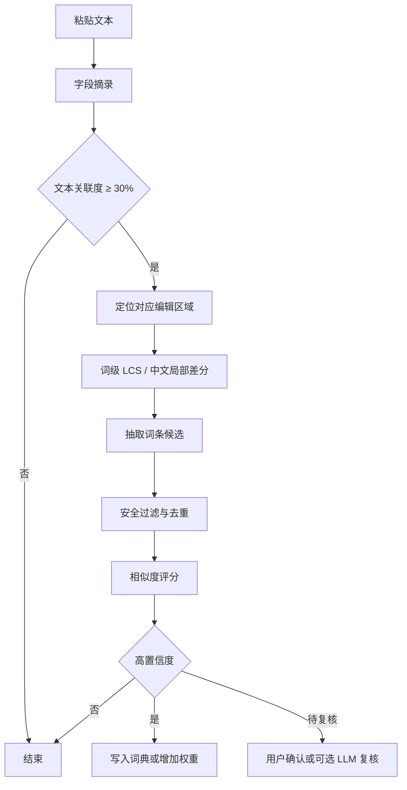

# 自动词典学习：本地候选优先，LLM 复核可选

## 目标

当 SayIt 将转录结果粘贴到用户正在编辑的输入框后，用户常会把识别错误的专有名词、产品名、技术术语或领域词改为正确写法。自动词典学习把这些高价值修正沉淀到本地词表，使下一次转录、后处理和提示词注入都能受益。

目标链路：

```text
完成粘贴
  → 锁定接收粘贴的目标应用
  → 有限时间内观察后续编辑
  → 读取游标附近字段摘录
  → 本地差分提取与评分
  → 写入 vocabulary 或提升已有词权重
  → HUD 提示已学习词条
```

词典学习属于后台增强能力：粘贴成功、转录保存、HUD 状态切换始终先完成。

当前工作区已经接入 `extractCorrections()` 与 `canonicalizeTranscription()` 原型。原型行为、LLM 回退和日志加固项见 [00-当前工作区原型评审.md](./00-当前工作区原型评审.md)；本文定义其可发布版本的模块契约。

## SayIt 当前链路

`src/stores/useVoiceFlowStore.ts` 已实现大部分系统集成：

1. `completePasteFlow()` 在 `paste_text` 成功后调用 `startCorrectionDetectionFlow()`。
2. `start_correction_monitor` 使用 `keyboard_monitor.rs` 的持久键盘监听，收集键入与 Enter 信号。
3. 前端每 500ms 调用 `read_focused_text_field`，保留最新 AX/UIA 文本摘录作为读取失败时的后备值。
4. `correction-monitor:result` 到达后，前端读取字段摘录并用包含关系、字符重叠率过滤明显无关的字段。
5. 当前实现在 `analyzeCorrections()` 中把原粘贴文本和字段摘录送到文本 LLM，解析返回的候选词并写入 `useVocabularyStore()`。

这条链路已经解决了跨平台键盘监听、目标字段读取、HUD 通知、重复词权重增加和 API 用量记录。首期改动集中在“字段摘录 → 候选词”这一步。

## 有赞参考实现的可复用结构

### 监控对象与时间窗口

`reference/textEditMonitor.js` 在显示覆盖层前先记录前台应用 PID，随后针对同一目标应用做 AX 监听。它包含三层可靠性策略：

| 策略 | 行为 | SayIt 对应能力 |
| --- | --- | --- |
| 目标锁定 | 热键按下时记录接收粘贴的应用 | SayIt 应在 `paste_text` 前记录焦点应用标识。 |
| 原生监听 | 通过原生 AXObserver 监听字段变化 | SayIt 现有键盘监听负责触发，AX 读取负责取样。 |
| 轮询后备 | 500ms 读取字段值，默认持续 30 秒 | SayIt 已有 500ms 轮询和 15 秒硬上限。 |

`reference/correctionLearner.js` 的候选提取由以下组件组成：

| 组件 | 作用 |
| --- | --- |
| `findEditedRegion()` | 从字段全文或摘录中定位最可能对应原粘贴内容的区域。 |
| `findSubstitutions()` | 使用词级 LCS 将删除块与插入块对齐为替换对。 |
| `extractLocalizedCjkSubstitutions()` | 对中文局部替换做字符级前缀/后缀定位。 |
| `extractTermCandidates()` | 从混合中英文片段中抽取短词、标识符与嵌入的 Latin 术语。 |
| `isSafeCorrectionCandidate()` | 限制长度、词数、标点、句子片段、代词和语气词。 |
| `collectCorrectionCandidates()` | 去重、排除同形词，按编辑距离或拼音相似度筛选。 |

SayIt 需要保留这个分层结构，避免把整句改写误收录为长期词典。

## 目标设计

### 1. 新增纯函数模块

新增 `src/lib/correctionLearner.ts`，只处理字符串，不访问 Tauri、Pinia、数据库和网络。

```ts
export type CorrectionConfidence = "high" | "review" | "rejected";

export interface CorrectionCandidate {
  term: string;
  sourceText: string;
  confidence: CorrectionConfidence;
  reasonList: string[];
}

export interface ExtractCorrectionOptions {
  existingTermList: string[];
  enablePinyinMatching: boolean;
}

export function extractCorrectionCandidates(
  originalText: string,
  fieldExcerpt: string,
  options: ExtractCorrectionOptions,
): CorrectionCandidate[];
```

模块应导出足够小的辅助函数，供 Vitest 覆盖：

```text
normalizeCandidate()
tokenize()
findEditedRegion()
findWordSubstitutions()
findLocalizedCjkSubstitutions()
extractTermCandidates()
isSafeCorrectionCandidate()
scoreCandidate()
extractCorrectionCandidates()
```

### 2. 候选管线



每步规则如下。

#### A. 关联度门槛

复用当前 `useVoiceFlowStore.ts` 的两项保护：

- 字段摘录与原文本互相包含时视为未发生有效修正。
- 字段摘录中的字符有至少 30% 落在原文本中，才进入差分流程。

新增一条长度门槛：`fieldExcerpt.length <= max(160, originalText.length * 4)`。超长摘录常来自错误焦点或整份文档，直接跳过能避免学习整段内容。

#### B. 编辑区域定位

AX/UIA 当前返回“游标附近、有上限”的摘录，字段值并非完整文档。实现采用两段策略：

1. 摘录长度不超过原文 1.5 倍时，直接作为编辑区域。
2. 摘录更长时，使用词级滑动窗口寻找与原文重合度最高的片段；重合度低于 30% 时跳过。

中文无空格场景优先采用最长公共前缀/后缀定位局部改动。长句大范围改写、插入大量新内容、删除多数原始内容都归类为 `rejected`。

#### C. 词条形态过滤

候选必须满足：

| 规则 | 建议阈值 | 原因 |
| --- | --- | --- |
| 总字符数 | 2–40 | 过滤单字符和长文本。 |
| 英文词数 | 最多 4 个 | 保护技术短语，排除句子。 |
| 纯中文字符数 | 2–4 | 高置信度自动学习只收紧凑词组。 |
| 中英混合 | 最多 8 个中文字符，英文标识符最长 40 | 支持 `Vue.js`、`OpenAI API`、`VitePress`。 |
| 禁止字符 | 换行、路径分隔符、`@`、控制字符 | 排除地址、日志行、命令片段。 |
| 句子碎片 | 代词、口语指代、语气词、高频动作词 | 降低把普通表达写入词典的概率。 |

候选规范化包含首尾标点清理、连续空白合并和 Unicode 大小写归一。重复判断采用 `trim().toLocaleLowerCase()`。

#### D. 相似度与置信度

高置信度候选必须来自替换关系，且满足以下任一组合：

| 场景 | 高置信度条件 | 复核条件 |
| --- | --- | --- |
| 英文、数字、标识符 | 标准化编辑距离比例 ≤ 0.50（短词）或 ≤ 0.65（长词） | 超出高置信阈值且替换块很短。 |
| 中文局部替换 | 原文和修正文本存在相同前后邻接字，改动区最多 4 字 | 单字改动缺少可靠边界。 |
| 中英混合 | 提取到明确 Latin 标识符，且候选通过长度规则 | 周围中文改动较大。 |
| 中文近音 | 拼音音节数一致，拼音编辑距离比例 ≤ 0.34 | 拼音组件缺席或多音字歧义。 |

首期可以将 `enablePinyinMatching` 保持为 `false`，保留 `PinyinMatcher` 接口和测试夹具。拼音实现进入后续独立变更，避免在词典学习主路径中引入未评估依赖。

### 3. Store 与数据模型

现有 `vocabulary.source` 已经是自由文本列，增加本地来源只需要扩展 TypeScript 联合类型与写入方法：

```ts
export type VocabularySource = "manual" | "ai" | "auto_local";
```

`useVocabularyStore.ts` 新增：

```ts
async function addAutoLearnedTerm(term: string): Promise<void>;
const autoLearnedTermList = computed(() =>
  termList.value.filter((entry) => entry.source === "auto_local"),
);
```

现有数据库列已经允许 `source = 'auto_local'`，因此这一步无需新 schema 列。建议在 SQLite v9 增加词典学习审计表，让用户可以回看、删除或纠正自动学习结果：

```sql
CREATE TABLE IF NOT EXISTS vocabulary_learning_events (
  id TEXT PRIMARY KEY,
  vocabulary_id TEXT,
  source TEXT NOT NULL CHECK(source IN ('auto_local', 'ai_review')),
  confidence TEXT NOT NULL CHECK(confidence IN ('high', 'review')),
  reason_list_json TEXT NOT NULL,
  original_length INTEGER NOT NULL,
  field_excerpt_length INTEGER NOT NULL,
  created_at TEXT NOT NULL DEFAULT (datetime('now')),
  FOREIGN KEY (vocabulary_id) REFERENCES vocabulary(id)
);
```

事件表只存长度、策略和理由编码，避免保存原粘贴文本、字段摘录与截图内容。`vocabulary_id` 在重复词权重增加场景中指向已有词条。

### 4. Flow Store 接入

`startCorrectionDetectionFlow()` 现有职责应保持：监听生命周期、快照后备、AX 读取、字段关联度和 HUD 通知。内部逻辑替换为：

```ts
const candidateList = extractCorrectionCandidates(pastedText, fieldText, {
  existingTermList: vocabularyStore.termList.map((entry) => entry.term),
  enablePinyinMatching: settingsStore.isPinyinCorrectionLearningEnabled,
});

const highConfidenceTerms = candidateList
  .filter((candidate) => candidate.confidence === "high")
  .map((candidate) => candidate.term);

await vocabularyStore.applyAutoLearnedTerms(highConfidenceTerms, candidateList);
```

当 `isLlmVocabularyReviewEnabled` 开启时，仅把 `confidence === "review"` 的少量候选、替换对和结构化理由发送给 `analyzeCorrections()` 的新接口。该接口返回受限于候选集合的确认结果，避免把完整字段文本交给模型。

### 5. 配置项

新增的设置值建议进入现有 settings store：

| 键 | 默认值 | 作用 |
| --- | --- | --- |
| `isSmartDictionaryEnabled` | 现有值 | 自动学习总开关。 |
| `isLocalCorrectionLearningEnabled` | `true` | 启用本地高置信度提取。 |
| `isLlmVocabularyReviewEnabled` | `false` | 将边界候选交给 LLM 复核。 |
| `isPinyinCorrectionLearningEnabled` | `false` | 启用中文近音相似度策略。 |
| `correctionLearningDurationMs` | `15000` | 与 Rust 硬上限保持一致，可在后续实验中调整。 |

涉及这些开关的用户界面应先在 `design.pen` 完成状态、文案和禁用态设计。

## 隐私与日志修正

当前 `useVoiceFlowStore.ts` 会记录原粘贴文本、字段摘录以及 LLM 原始回复的前 80 字或全文。这些值可能包含聊天内容、密码附近文本、客户资料和源代码。

自动词典学习改造时同步调整为结构化诊断：

```text
[correction] field-associated originalLength=48 excerptLength=76 overlap=0.62
[correction] candidates high=2 review=1 rejected=4 elapsedMs=18
[correction] vocabulary-updated added=1 incremented=1
```

错误报告使用 `source: "voice-flow"`、`step: "correction-learning"`、平台、候选数量和错误类别；文本内容停留在内存中，直到本次会话结束。

## 边界情况

| 场景 | 预期处理 |
| --- | --- |
| 用户没有按键 | `correction-monitor:result` 直接结束。 |
| 用户按 Enter 发送消息 | 立即读取字段；读取为空时使用最后一份快照。 |
| 焦点切换到其他应用 | 通过目标应用标识和低关联度过滤结束学习。 |
| 输入框读取失败 | 使用最后一份快照；快照缺失时静默结束。 |
| 用户整句重写 | 返回空候选。 |
| 用户新增一句解释 | LCS 与改动比例过滤，不写入词典。 |
| 已存在词条 | 增加 `weight`，写入一次学习事件。 |
| 同一会话多次触发 | 清理旧 listener、停止旧轮询后再开始新会话。 |
| LLM 复核超时或失败 | 保留本地高置信度结果，复核候选本次结束。 |

## 测试夹具与验收

新增 `tests/unit/correction-learner.test.ts`，至少覆盖：

| 用例 | 输入 | 期望 |
| --- | --- | --- |
| 英文产品名修正 | `view js` → `Vue.js` | 学习 `Vue.js`。 |
| 技术标识符修正 | `vite press` → `VitePress` | 学习 `VitePress`。 |
| 一般句子改写 | `今天天气很好` → `今天天气不错` | 空集合。 |
| 新增解释文本 | 原文后追加完整句子 | 空集合。 |
| 关联度不足 | 无关字段摘录 | 空集合。 |
| 已有词条 | 候选已在词典中 | 增加权重，候选结果保留引用。 |
| 中文局部替换 | 相同邻接字中的短词修正 | 产生受限候选。 |
| 长句大范围变更 | 多个替换块、低 LCS | 空集合。 |
| 特殊字符 | 路径、换行、邮箱样式字符串 | 空集合。 |

集成测试覆盖 `completePasteFlow()` 后的生命周期：粘贴成功、监控启动、事件到达、候选写入、HUD 通知、listener 清理。执行顺序见 [04-实施顺序与验证.md](./04-实施顺序与验证.md)。
