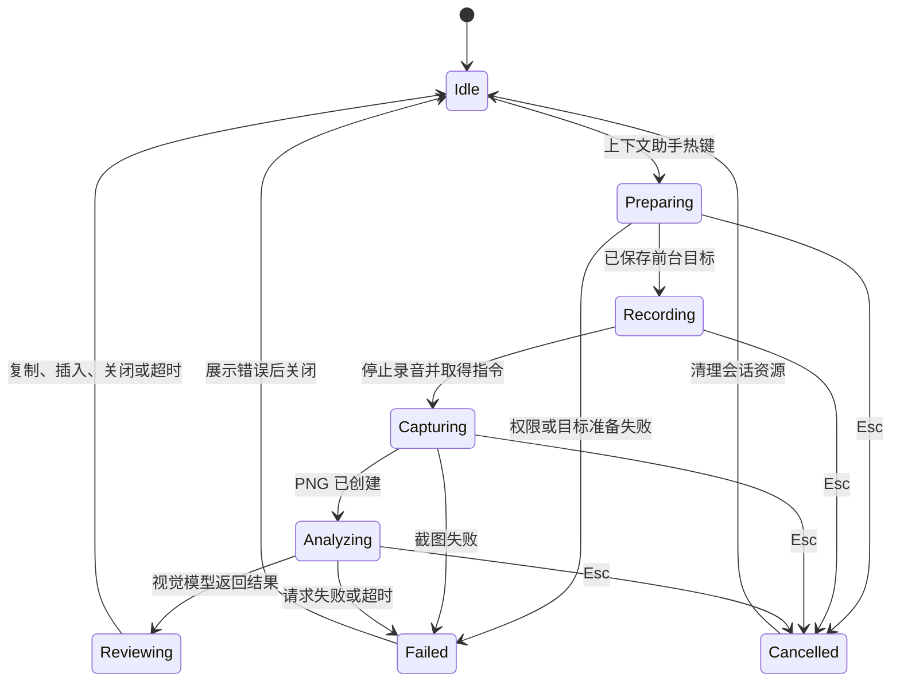
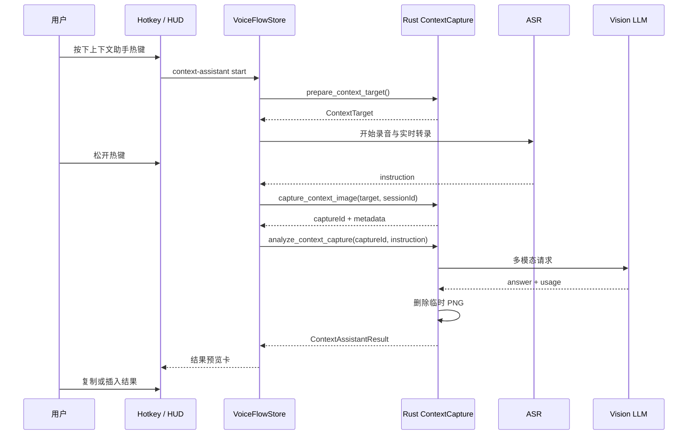

# 截图上下文助手：显式捕获、视觉推理、临时保留

## 用户体验目标

截图上下文助手让用户在当前屏幕上发起一次语音请求，例如：

- “总结这页的三项风险。”
- “根据这个表格生成一封跟进邮件。”
- “解释这里的报错并给出修复步骤。”
- “把这段界面文案改得更简洁。”

用户按下专用“上下文助手”热键后，SayIt 记录当前前台目标并开始录音。停止录音后，SayIt 将本次语音转录、明确的任务提示和一张临时截图发送给用户配置的视觉模型。结果以可预览、可复制、可插入的卡片呈现；涉及外部系统操作的内容只生成建议和文本，不执行系统命令。

普通听写继续使用既有粘贴链路。上下文助手使用独立的 `context_assistant` 运行模式，避免把模型回答自动粘贴到输入框。

当前工作区已有将主显示器截图附加到普通听写整理请求的原型。该原型与本节的专用助手设计存在刻意的会话、隐私和交互差异，具体评审见 [00-当前工作区原型评审.md](./00-当前工作区原型评审.md)。

## 有赞参考实现

`reference/screenshotCaptureService.js` 和 `reference/difyFlowService.js` 展示了一条完整的桌面截图助手流程：

```text
语音助手热键
  → 检查截图优化开关
  → 读取前台应用与焦点元素
  → 可编辑输入框所在窗口优先截图
  → 其余场景截取鼠标所在显示器
  → PNG 写入临时目录
  → 上传图像并提交语音指令
  → 获取回答
  → 删除临时 PNG
```

参考实现的关键细节：

| 行为 | 参考代码位置 | 对 SayIt 的启发 |
| --- | --- | --- |
| 焦点窗口优先 | `resolveMacOSAnalysisContext()` | 视觉上下文优先聚焦用户正在编辑的窗口，减少无关屏幕内容。 |
| 显示器回退 | `getCursorDisplayContext()` | 缺少可用窗口边界时，使用鼠标所在显示器并在界面告知范围。 |
| 系统截图 | macOS `screencapture -x -R` | 截图命令运行在原生层，设置超时并检查输出大小。 |
| 临时文件 | `createScreenshotFilePath()`、`removeScreenshot()` | 图像生命周期绑定单次请求，任务结束即清理。 |
| 图像与文本分离 | `uploadAnalysisFile()`、`queryAiOptimize()` | SayIt 可把捕获与模型调用拆成可测模块。 |

SayIt 应复用这些行为边界，保留自己的模型配置、请求协议与隐私规则。

## 运行状态机



每个会话都有 `sessionId` 与 `AbortController`。异步任务在写回 UI 前检查当前 `sessionId`，从而避免上一次请求的延迟结果覆盖下一次录音。

## 目标架构

### 模块分工

| 层级 | 新增或修改模块 | 职责 |
| --- | --- | --- |
| Rust 平台层 | `src-tauri/src/plugins/context_capture.rs` | 前台窗口元数据、截图、临时文件租约、删除与启动时清理。 |
| Rust 注册层 | `plugins/mod.rs`、`lib.rs` | 导出模块、管理 `ContextCaptureStore`、注册 Tauri commands。 |
| 前端流程层 | `src/stores/useVoiceFlowStore.ts` | 增加 `context_assistant` 调用模式，复用录音与 ASR 编排。 |
| 前端业务层 | `src/lib/contextAssistant.ts` | 组装请求、管理会话状态、调用 Tauri command、归一化模型结果。 |
| 前端类型 | `src/types/contextAssistant.ts` | 捕获元数据、会话状态、结果和错误类型。 |
| 设置与模型 | `useSettingsStore.ts`、`modelRegistry.ts` | 功能开关、视觉模型配置、能力标记。 |
| UI | Pencil 设计后新增 HUD / Dashboard 组件 | 权限提示、录音状态、结果卡、插入与复制操作。 |
| 数据层 | `database.ts` v9 | 可选的使用量和会话元数据，不保存图像。 |

### 复用既有语音链路

上下文助手和普通听写共享音频采集、Doubao SeedASR、HUD 波形和快捷键冲突保护。`useVoiceFlowStore` 需要引入显式调用上下文：

```ts
export type VoiceInvocationMode = "dictation" | "context_assistant";

export interface VoiceInvocationContext {
  mode: VoiceInvocationMode;
  sessionId: string;
  target: ContextTarget | null;
}
```

流程分支只出现在最终处理阶段：

```text
ASR 结果
  ├─ dictation          → LLM 文本整理 → completePasteFlow()
  └─ context_assistant  → 捕获图像 → 视觉推理 → 结果卡
```

这样可以复用成熟的录音状态、错误处理和 Sentry 集成，同时让“自动粘贴”和“结果确认”保持清晰边界。

## 截图会话协议

### 核心类型

```ts
export type ContextCaptureMode = "window" | "display";

export interface ContextTarget {
  appName: string | null;
  processId: number | null;
  role: string | null;
  bounds: { x: number; y: number; width: number; height: number } | null;
  preferredMode: ContextCaptureMode;
  capturedAt: string;
}

export interface ContextCaptureMetadata {
  captureId: string;
  mode: ContextCaptureMode;
  width: number;
  height: number;
  byteLength: number;
  expiresAt: string;
}

export interface ContextAssistantRequest {
  sessionId: string;
  captureId: string;
  instruction: string;
  model: string;
  baseUrl: string;
  apiKey: string;
}
```

Rust 的 `ContextCaptureStore` 持有 `captureId → 临时文件租约`：

```text
CaptureLease
  ├─ absolute_path        仅驻留 Rust 进程
  ├─ created_at
  ├─ expires_at
  ├─ capture_mode
  ├─ target_app_name
  └─ cleanup_state
```

WebView 只接收 `captureId`、尺寸、字节数和采集模式，避免前端获取任意本地绝对路径。

### Tauri Commands

建议首期定义以下最小命令集：

| Command | 输入 | 输出 | 说明 |
| --- | --- | --- | --- |
| `prepare_context_target` | 无 | `ContextTarget` | 在 HUD 出现前记录前台应用、焦点角色与可用窗口范围。 |
| `capture_context_image` | `ContextTarget`、`sessionId` | `ContextCaptureMetadata` | 创建 PNG、写入租约并返回不透明标识。 |
| `analyze_context_capture` | `ContextAssistantRequest` | `ContextAssistantResult` | 从 Rust 租约读取 PNG，调用兼容视觉输入的 LLM endpoint。 |
| `release_context_capture` | `captureId` | `void` | 立即删除本次临时截图。 |
| `cleanup_expired_context_captures` | 无 | `number` | 清理过期租约，供启动时和错误恢复使用。 |

`analyze_context_capture` 在 Rust 侧读取图片、构造 OpenAI-compatible 多模态请求、解析响应后删除图片。前端传入的 API key 只在该次 command 生命周期中使用；该 key 的持久化仍由 `tauri-plugin-store` 管理。

### 多模态请求格式

当用户已配置支持视觉内容的 OpenAI-compatible endpoint 时，Rust 请求可采用：

```json
{
  "model": "user-configured-vision-model",
  "messages": [
    {
      "role": "system",
      "content": "你是桌面上下文助手。基于截图和用户指令给出准确、可执行的文本建议。无法确定的内容要标注不确定性。"
    },
    {
      "role": "user",
      "content": [
        { "type": "text", "text": "用户指令：总结这页的三项风险。" },
        {
          "type": "image_url",
          "image_url": { "url": "data:image/png;base64,...", "detail": "low" }
        }
      ]
    }
  ],
  "temperature": 0.2,
  "max_tokens": 1200
}
```

模型能力来自用户配置，而非模型名称猜测。首期设置增加以下字段：

| 键 | 默认值 | 说明 |
| --- | --- | --- |
| `isContextAssistantEnabled` | `false` | 上下文助手总开关。 |
| `contextAssistantHotkey` | 空 | 专用快捷键，避免复用普通听写热键。 |
| `contextAssistantVisionModelId` | 空 | 用户确认可处理图片的模型 ID。 |
| `isContextAssistantVisionEnabled` | `false` | 模型能力确认标记。 |
| `contextCaptureRetentionSeconds` | `60` | 单张临时截图租约上限。 |
| `isRecentTranscriptionContextEnabled` | `false` | 是否额外提供近期转录摘要。 |

视觉模型未配置时，入口显示配置引导；模型能力已配置时才允许开始上下文助手。

## 平台采集策略

### macOS

1. `prepare_context_target` 通过 AX API 取得前台应用、焦点元素角色和 `AXWindow` 边界。
2. 文本输入角色如 `AXTextField`、`AXTextArea`、`AXSearchField`、`AXComboBox` 且窗口边界有效时，选择 `window` 模式。
3. 其他角色使用鼠标所在显示器的范围，选择 `display` 模式。
4. `capture_context_image` 调用系统 `screencapture -x -R x,y,width,height <temp.png>`；没有有效矩形时截取当前显示器。
5. 屏幕录制权限缺失时，回传结构化错误 `screen_recording_permission_required`，HUD 展示系统设置入口。

坐标转换必须覆盖多显示器、Retina 缩放、负坐标显示器和全屏 Space。截图目标在 HUD 出现前准备，避免 HUD 覆盖或改变目标窗口焦点。

### Windows

1. 使用 Win32 前台窗口 API 获取 HWND、进程和窗口矩形。
2. 首期以窗口矩形为优先范围，回退到当前显示器工作区。
3. 使用 Windows Graphics Capture 或 GDI `BitBlt` 输出 PNG。
4. 新增平台依赖前，先确认窗口最小化、HDR、DPI 缩放、受保护内容和多显示器场景的行为。

Windows 采集实现进入独立 PR；功能开关在该平台保持隐藏，直到端到端自动化覆盖完成。

## 会话时序



Esc、录音取消、截图失败、网络超时和模型返回错误都进入同一个清理路径：取消请求、释放 `captureId`、隐藏敏感预览、恢复 `idle` 状态。

## 结果呈现与插入

上下文助手响应的默认行为是“先预览，后操作”。Pencil 设计应覆盖：

| 状态 | HUD / Dashboard 内容 | 操作 |
| --- | --- | --- |
| 准备中 | 当前范围标签，例如“正在理解当前窗口” | Esc 取消。 |
| 录音中 | 波形、录音时长、上下文范围标签 | 松开结束。 |
| 截图中 | 进度状态，不展示完整图片缩略图 | Esc 取消。 |
| 推理中 | 指令摘要和隐私提示 | Esc 取消。 |
| 结果 | 回答文本、复制、插入、重新提问 | 用户显式选择。 |
| 失败 | 可理解的错误与设置入口 | 重试、关闭。 |

“插入结果”复用 `paste_text`，并仅在用户点击后执行。结果卡不会保存截图；用户选择保存文本时，历史记录可标记 `operation_mode = 'context_assistant'`。

## 安全与性能限制

| 限制 | 建议值 | 目的 |
| --- | --- | --- |
| 单张图片大小 | 5 MiB | 限制内存、编码和上传成本。 |
| 最大尺寸 | 长边 2048 px | 控制视觉 token 与请求耗时。 |
| 捕获超时 | 5 秒 | 避免系统命令长期阻塞。 |
| 推理超时 | 45 秒 | 覆盖视觉模型的典型响应时间。 |
| 临时租约 | 60 秒 | 异常路径自动清理。 |
| 并发会话 | 1 | 防止多次截图互相覆盖。 |
| 上传协议 | HTTPS | 保护图像与语音指令传输。 |

当图片超过限制时，Rust 先进行等比缩放和 PNG/JPEG 编码，再向模型请求。压缩策略、原图保留时长和错误信息都进入单元测试。

## 验收标准

1. 功能关闭或视觉模型未配置时，上下文助手热键入口提供明确配置提示。
2. 已授权 macOS 环境中，焦点文本窗口产生 `window` 范围截图；普通应用产生 `display` 范围截图。
3. 截图文件只存在于 Rust 管理的临时目录，完成、取消、异常和重启后均可清除。
4. WebView 日志、Sentry extra、SQLite 表和一般诊断日志中不出现截图二进制、绝对路径或图像 OCR 文本。
5. 助手结果停留在预览卡，用户点击“插入”后才调用 `paste_text`。
6. 视觉 endpoint 收到一张图片和当前语音指令；普通听写请求保持文本协议。
7. 连续启动两次会话时，前一会话的延迟结果不会覆盖后一会话状态。

隐私、数据保留和模型上下文的完整约束见 [03-上下文与数据边界.md](./03-上下文与数据边界.md)。
