# 有赞语音输入参考与 SayIt 实施设计

> 更新日期：2026-07-29
> 范围：自定义词学习、上下文感知、截图语音助手、ASR 上下文与隐私边界

本目录沉淀有赞语音输入 3.2.3 的静态研究结论，并将可复用的行为拆解为 SayIt 的实施设计。这里描述的是 SayIt 自研功能的目标状态、模块边界和验证标准；产品代码继续使用 SayIt 自有的 Tauri、SQLite、ASR、LLM 与鉴权配置。

## 阅读入口

| 文档 | 解决的问题 |
| --- | --- |
| [00-当前工作区原型评审.md](./00-当前工作区原型评审.md) | 对齐当前未提交原型与目标架构，列出发布前的加固项。 |
| [01-自动词典学习.md](./01-自动词典学习.md) | 用户修正后，如何在本地高置信度学习词条，并将 LLM 复核保留为可选路径。 |
| [02-截图上下文助手.md](./02-截图上下文助手.md) | 如何通过显式热键采集窗口或屏幕上下文，交给支持视觉输入的模型处理。 |
| [03-上下文与数据边界.md](./03-上下文与数据边界.md) | 哪些数据可以进入 ASR/LLM、保留多长时间、如何提供用户控制。 |
| [04-实施顺序与验证.md](./04-实施顺序与验证.md) | 分阶段改动范围、风险门、测试矩阵和验收标准。 |
| [reference/README.md](./reference/README.md) | 参考源码来源、校验方式和安全约束。 |



流程源文件：[implementation-flow.mmd](./implementation-flow.mmd)。

## 当前工作区快照

工作区当前已包含本地词典学习、规范词归一和屏幕上下文原型。该原型会在屏幕上下文开关开启后，为普通听写采集主显示器并向当前 LLM 请求附加图片。可发布目标将其演进为专用语音助手、受控截图范围和用户确认结果流。细节与差距见 [00-当前工作区原型评审.md](./00-当前工作区原型评审.md)。

## 研究结论

### 1. 词典学习应以本地确定性判断为主

有赞的 `correctionLearner.js` 将“粘贴文本”与“用户随后编辑的字段值”做局部差分，只把符合词条形态、改动范围和读音相似度约束的候选写入词典。这个思路适合 SayIt：词典属于长期影响转录质量的数据，应优先使用可复现、可测试、可解释的本地规则。

SayIt 当前已具备完整的修正监控链路：

```text
completePasteFlow()
  → startCorrectionDetectionFlow()
  → start_correction_monitor（Rust 全局键盘监听）
  → read_focused_text_field（AX / UI Automation）
  → analyzeCorrections（LLM）
  → useVocabularyStore
```

目标实现保留这条链路，并将 `analyzeCorrections()` 前置替换为本地候选提取。高置信度候选立即写入；边界候选由用户确认或交给已开启的 LLM 复核策略处理。

### 2. 截图能力适合“显式调用、会话级临时文件”

有赞的截图助手在语音助手热键触发后才采集图像，并优先截取可编辑焦点所在窗口；缺少可用窗口范围时退回当前显示器。截图上传后立即用于一次 LLM 请求，再从临时目录清理。

SayIt 应采用同样的会话边界，并新增更严格的控制：

- 功能开关默认关闭；首次启用时展示屏幕录制权限和上传范围说明。
- 每次截图都由专用语音助手热键或界面按钮发起。
- 前端只拿到不透明的 `captureId`，Rust 管理实际临时文件路径。
- 任务完成、取消、超时、应用再次启动时均执行清理。
- 视觉请求只在当前模型具备 `supportsVision` 能力时可用。

### 3. 上下文需要分层，而不是一次性上传全部信息

参考实现会结合前台应用名称、焦点控件、选中文本、截图和近期转录记录。SayIt 应按敏感度分层处理：

| 层级 | 数据 | 默认用途 | 传输范围 |
| --- | --- | --- | --- |
| L0 | 当前应用类型、焦点角色、窗口范围 | 本地路由与截图范围选择 | 本地 |
| L1 | 已显式选中的文本 | 编辑模式提示词 | 当前 LLM 请求 |
| L2 | 近期转录摘要 | ASR/LLM 上下文增强 | 用户开启后进入当前请求 |
| L3 | 截图 | 视觉语音助手 | 用户显式触发后进入当前请求 |

完整规则见 [03-上下文与数据边界.md](./03-上下文与数据边界.md)。

## SayIt 已发布基线与目标增量

| 能力 | SayIt 当前实现 | 目标增量 | 首要落点 |
| --- | --- | --- | --- |
| 粘贴后修正监控 | Rust 键盘监听 + 500ms AX 文本快照 | 加入本地差分与候选评分 | `src/lib/correctionLearner.ts` |
| 词典写入 | `vocabulary(term, weight, source)`，来源为 `manual` 或 `ai` | 增加 `auto_local` 来源和候选元数据 | `src/types/vocabulary.ts`、`src/lib/database.ts` |
| LLM 词典复核 | `analyzeCorrections()` 将原文与字段摘录发给 LLM | 降级为显式可选的边界候选复核 | `src/lib/vocabularyAnalyzer.ts` |
| 前台文本访问 | `text_field_reader.rs` 提供焦点字段摘录和选区读取 | 提供最小化的前台应用/窗口元数据 | `src-tauri/src/plugins/` |
| 语音助手截图 | 已发布基线没有专用采集管线；工作区原型会附加主显示器截图 | 受热键和权限控制的临时截图会话 | `context_capture.rs`、`screenshotAssistant.ts` |
| LLM 调用 | OpenAI 兼容文本消息 | 扩展视觉内容消息与模型能力标记 | `src/lib/llmProvider.ts`、`src/lib/modelRegistry.ts` |
| 使用记录 | `api_usage` 覆盖 whisper/chat/vocabulary_analysis | 增加 `context_assistant` 使用类型 | SQLite v9 migration |

## 参考源码映射

`reference/` 内的文件保留原始 JavaScript / TypeScript，用于核对算法边界和平台行为。它们的 SHA256 已与本机解包源码逐一核验。

| 参考文件 | 可借鉴的行为 | SayIt 自研模块 |
| --- | --- | --- |
| `correctionLearner.js` | 差分、短词安全过滤、拼音近音校验、候选去重 | `src/lib/correctionLearner.ts` |
| `textEditMonitor.js` | 目标应用快照、AX 读取、轮询与原生监听降级 | 既有 `keyboard_monitor.rs` + `text_field_reader.rs` |
| `screenshotCaptureService.js` | 焦点窗口优先、显示器回退、临时文件回收 | `context_capture.rs` |
| `difyFlowService.js` | 图像上传与指令请求拆分 | `src/lib/screenshotAssistant.ts` |
| `volcengineStreaming.js` | ASR 首包上下文和资源配置分层 | 既有 `transcription.rs` 的上下文扩展 |
| `proxyClient.js` | 受控请求封装 | SayIt 的 `@tauri-apps/plugin-http` 请求层 |
| `builtinAsrDictionary.js` | 词表来源分层 | `useVocabularyStore.ts` 注入策略 |
| `contextClassifier.ts` | 基于应用名与文本特征的轻量场景分类 | `src/lib/contextClassifier.ts` |

## 关键架构原则

1. **粘贴主流程保持短路径。** `completePasteFlow()` 完成粘贴、保存记录和状态切换后，以 fire-and-forget 方式启动学习；学习失败不阻断下一次听写。
2. **长期词典走确定性规则。** 本地候选必须通过输入长度、改动比例、脚本类型、词条长度和重复词检查。
3. **原始文本最小化。** 调试日志只记录候选数量、字符长度、耗时、策略与错误类别；原文、字段摘录、截图和模型原始回复不进入常规日志。
4. **截图是一次性能力。** 捕获、上传、推理和清理属于同一个会话；SQLite 只保存操作元数据和用户最终采纳的文本。
5. **用户拥有控制权。** 自动学习、LLM 复核、近期上下文、截图助手都是独立开关，并在设置页提供清除动作。
6. **UI 先完成 Pencil 设计。** 新增开关、热键、截图状态和结果采纳界面进入 `design.pen` 后再实现 Vue 组件。

## 已知差异与取舍

| 主题 | 有赞参考实现 | SayIt 建议 |
| --- | --- | --- |
| 修正窗口 | 默认监控 30 秒 | 复用 SayIt 现有 15 秒硬上限，先通过真实使用数据验证时长。 |
| 中文近音 | 使用 `pinyin-pro` | 以可替换的 `PinyinMatcher` 接口接入；首期先覆盖英文、数字和局部 CJK 替换。 |
| 视觉模型 | 经业务代理上传至 Dify 工作流 | 走 SayIt 已配置的自有 LLM endpoint，并显式标记模型能力。 |
| 截图路径 | Electron 主进程返回文件路径 | Tauri 以 `captureId` 代表临时文件，降低 WebView 对本地路径的暴露。 |
| 上下文上报 | 参考实现包含业务遥测链路 | SayIt 仅保留本地诊断指标和用户配置的 LLM 请求。 |

## 关联的现有规范

- [`../_bmad-output/project-context.md`](../../_bmad-output/project-context.md)：项目实现规则与 IPC 约束。
- [`../_bmad-output/implementation-artifacts/tech-spec-smart-dictionary-learning.md`](../../_bmad-output/implementation-artifacts/tech-spec-smart-dictionary-learning.md)：现有智慧词典规格。
- [`../_bmad-output/implementation-artifacts/3-2-vocabulary-injection-whisper-ai.md`](../../_bmad-output/implementation-artifacts/3-2-vocabulary-injection-whisper-ai.md)：词汇注入转录模型的已有设计。
- [`../design.pen`](../../design.pen)：所有新增用户界面的设计来源。

后续实现从 [04-实施顺序与验证.md](./04-实施顺序与验证.md) 的 Phase 0 开始。
